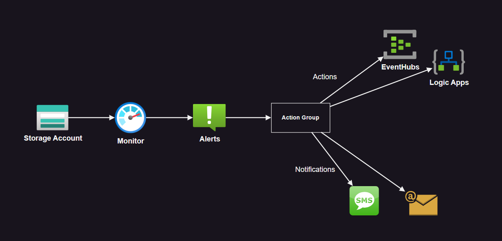

# Azure Monitor Alerts

Implementation for Azure Monitor Alerts



Create the infrastructure:

```sh
cp config/sample.tfvars .auto.tfvars
```

Create the infrastructure:

```sh
terraform init
terraform apply -auto-approve
```

Upload blobs to trigger the alarm:

```sh
az storage blob upload \
    --account-name <storage-account> \
    --container-name blobs \
    --name test.txt \
    --file test.txt \
    --auth-mode login
```
